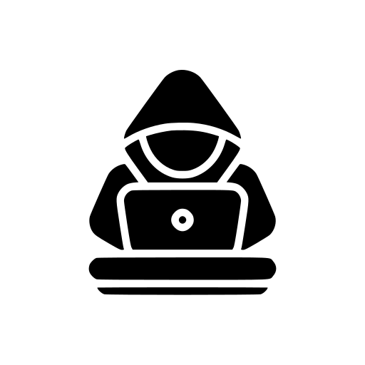

<p align="center">
  
  <h1 align="center">Beware</h1>
  <p align="center">Online platform for learning operations security</p>
</p>

## What is Beware?

Beware is a web platform, which puts its users in the shoes of a hacker, who managed to get inside someone's computer. Their goal is to complete a series of tasks and collect data from the unlocked device.

Thinking from the perspective of an attacker teaches users about ways their personal information can get stolen and how to protect it, by following security best practices.

See [the presentation](./beware.pdf) for more details.

### Features

-   Courses that share a common theme
-   Computer simulations
-   Questions, that guide you through the course
-   Course summaries

## Built with

-   Typescript
-   Next.JS
-   Prisma
-   tRPC
-   Docker
-   Webtop
-   NextAuth
-   SASS

## Quick Start

To get it running, follow the steps below:

### Setup dependencies

```diff
# Install dependencies
pnpm i

# Configure environment variables.
# There is an `.env.example` in the root directory you can use for reference
cp .env.example .env

# Push the Prisma schema to your database
pnpm db:push

# Seed the database (optional)
pnpm db:seed
```

# License

This program is free software: you can redistribute it and/or modify
it under the terms of the GNU Affero General Public License as published by
the Free Software Foundation, either version 3 of the License, or
(at your option) any later version.

See [LICENSE](./LICENSE) for more details.
